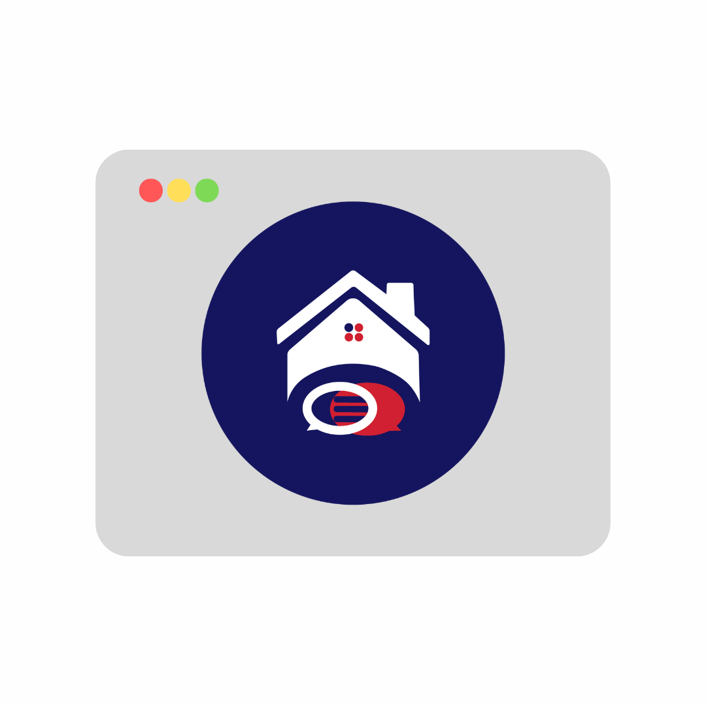
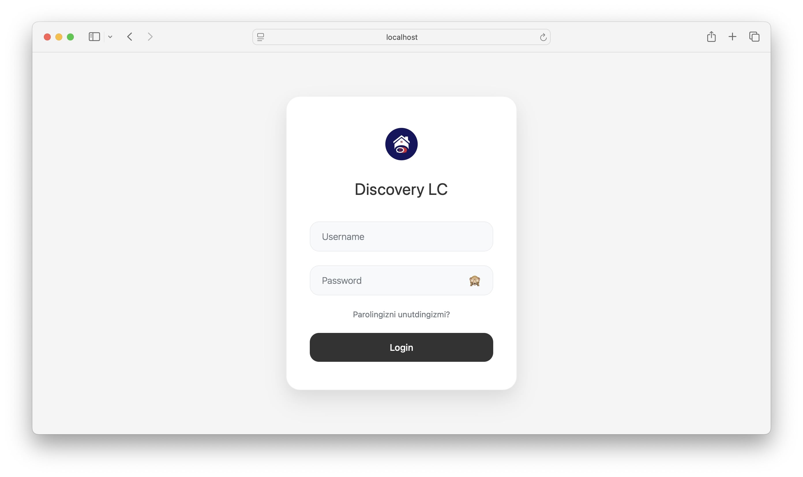
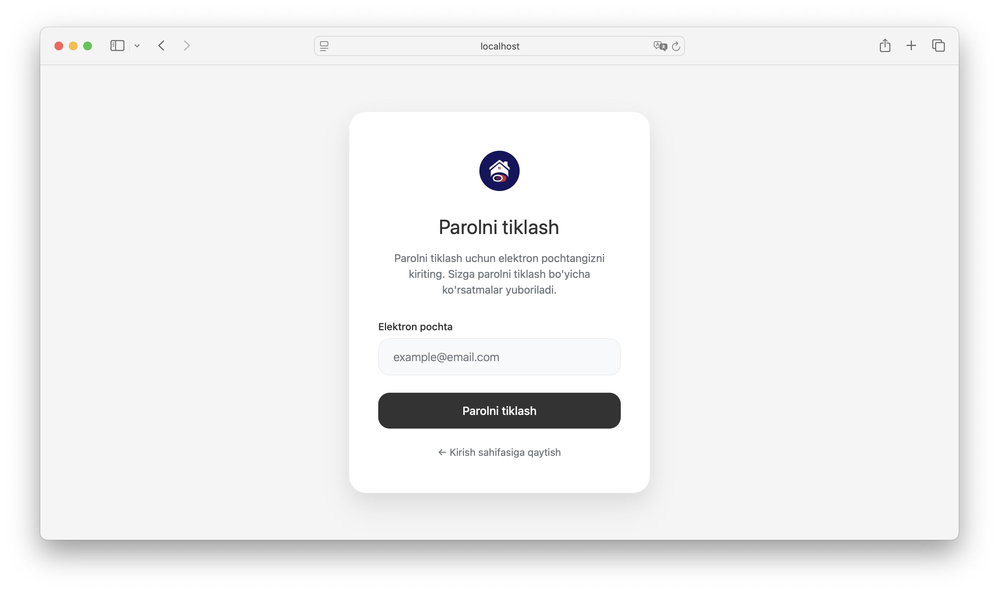
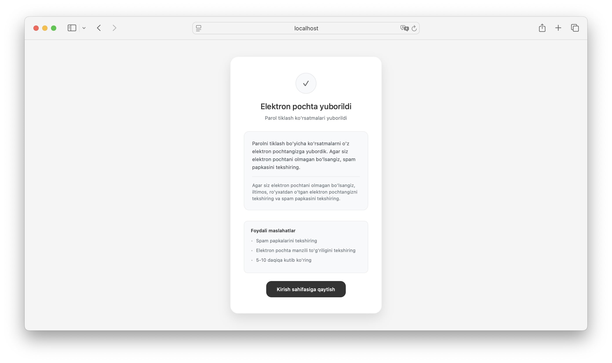
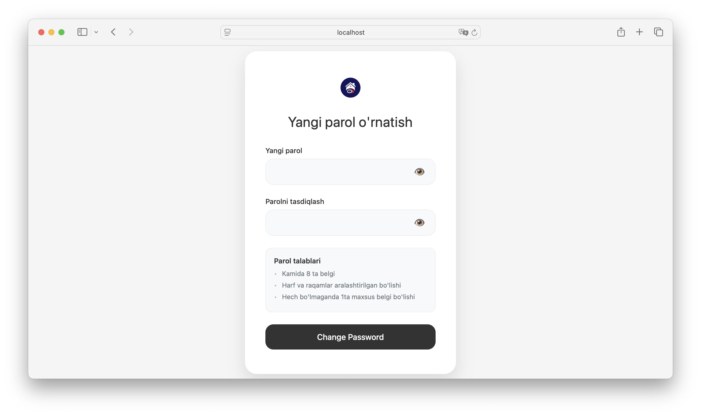
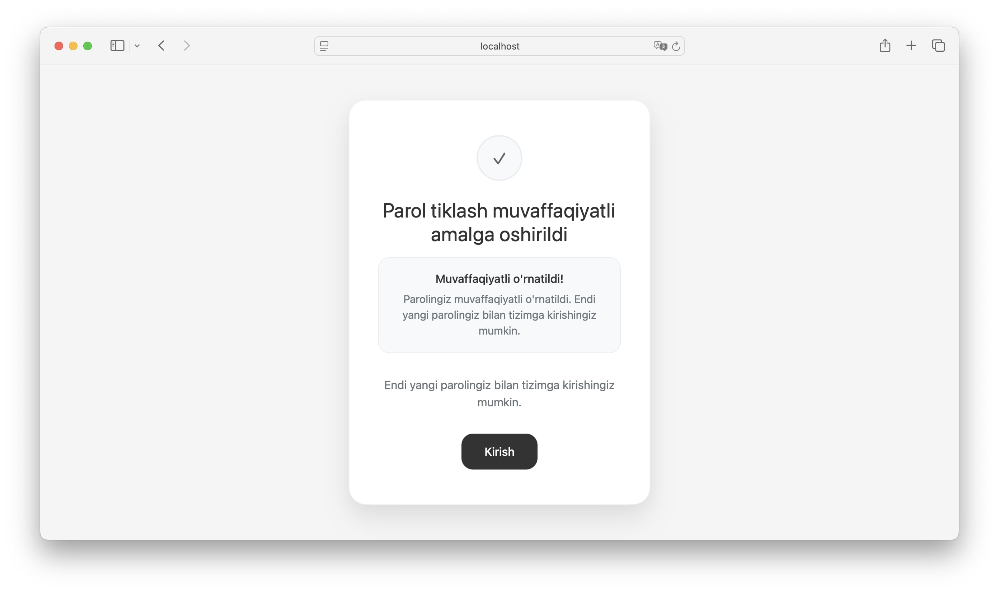
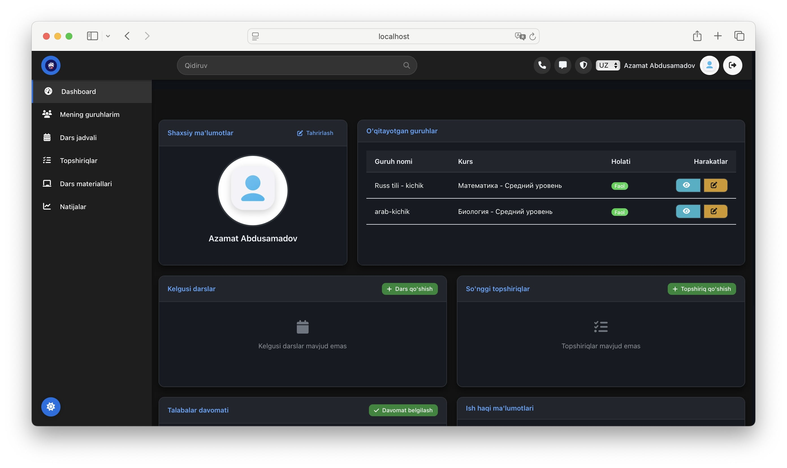
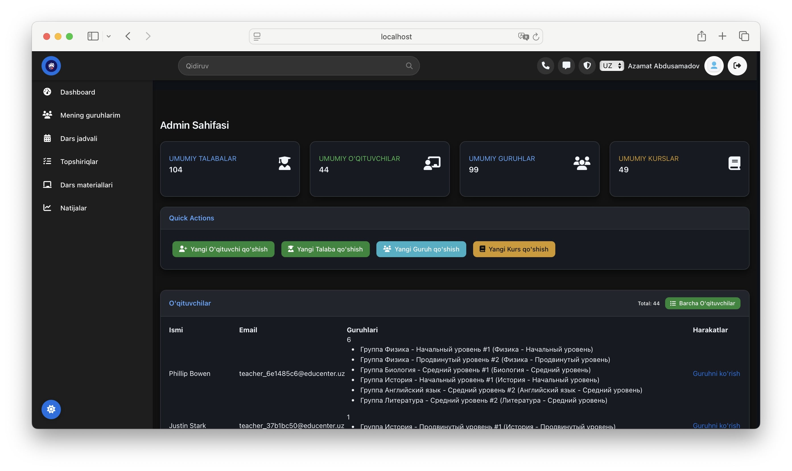
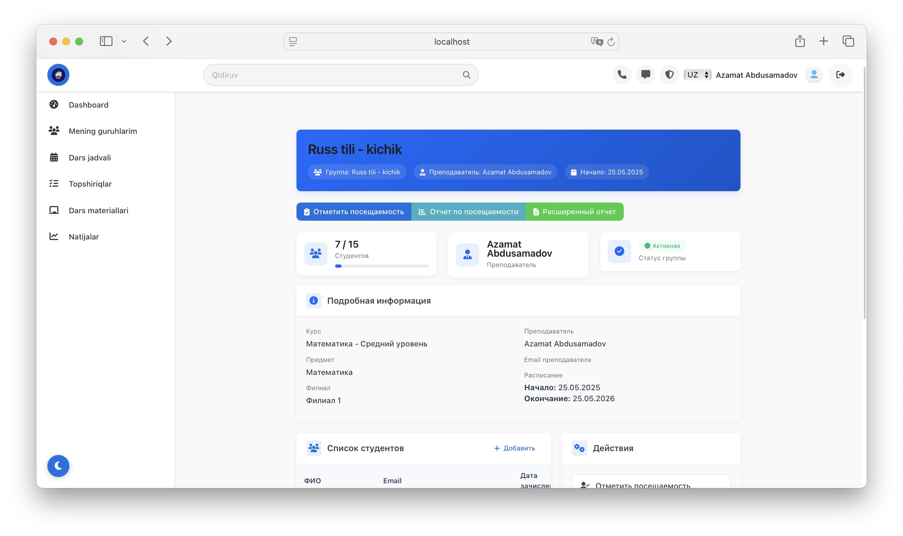
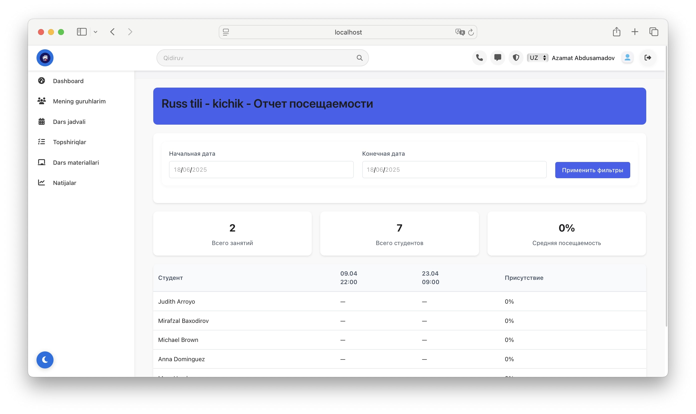

# Discovery_LC

<!-- 

 -->

EduTrack — это современная система управления образовательным процессом для школ, учителей и студентов.

## Структура проекта новая
- `templates/` — HTML-шаблоны
- `static/static_files` — статические файлы 

### Yangiladim oxirgi marta:
    - base.html, base.css, base.css - noldan qilindi.
    - login.html, password - (reset, done, confirm) barchasiga style berildi boshidan.
    - admin, teacher, attendence page lar to'g'irlandi 
    - + qora fonda ishlaydi gan bo'ldi.
    - keraksiz static filarni olib tashlab barchasini bitta directory ga olib kelindi.
    

